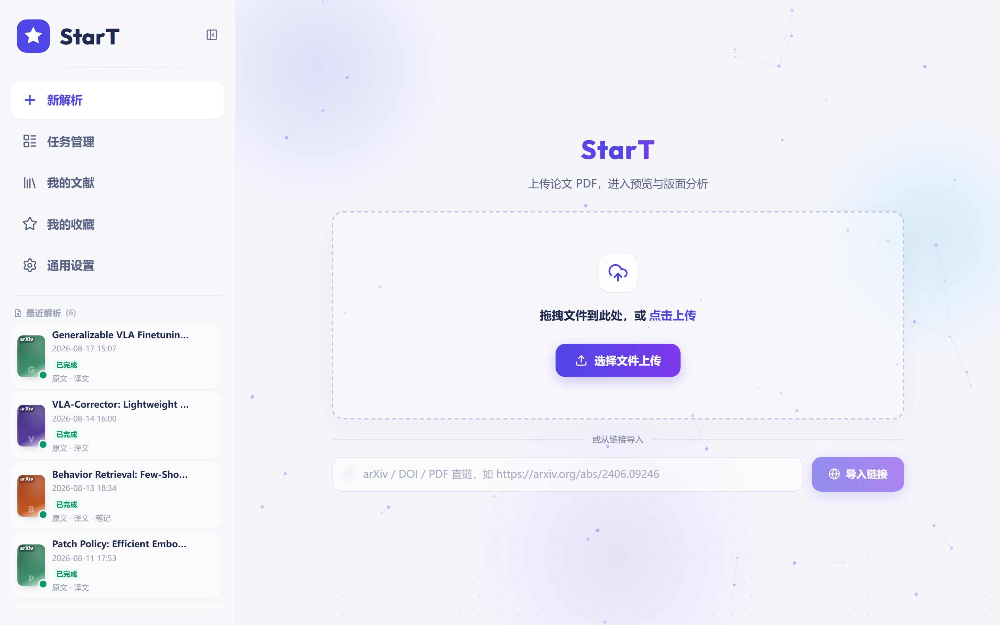
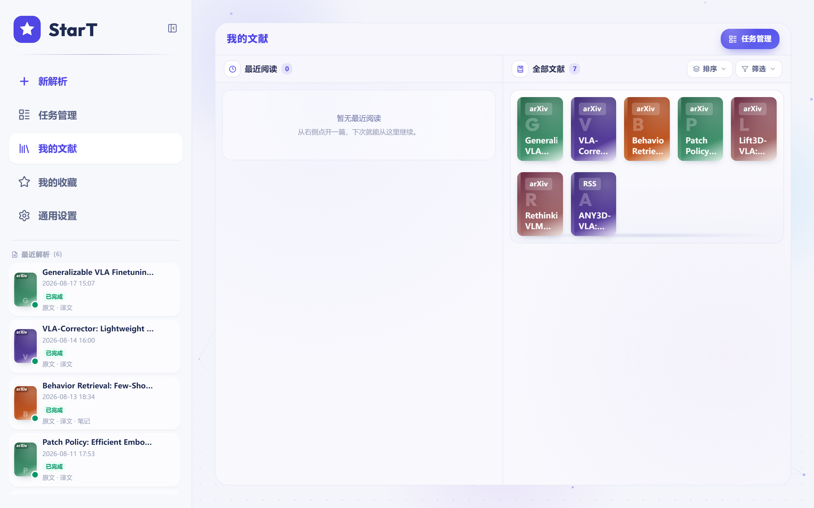
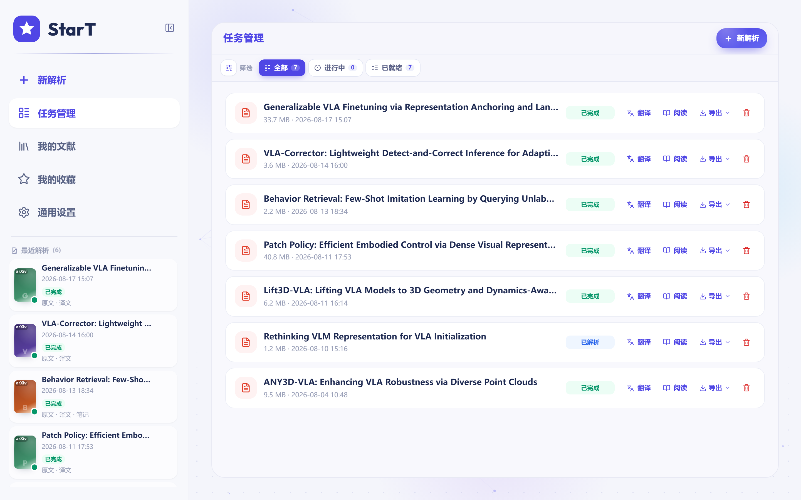
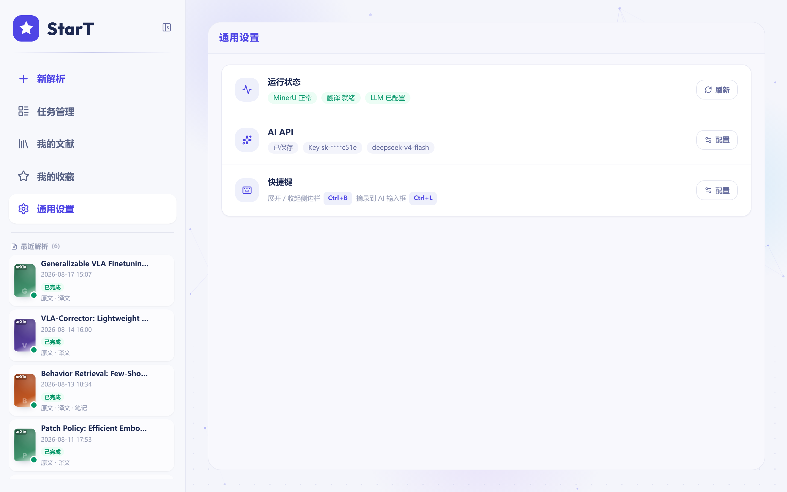

<div align="center">

# StarT

**本地优先的论文工作台 — 解析 · 翻译 · 阅读 · 管理**

[](LICENSE)
[](services/api/pyproject.toml)
[](apps/web/package.json)
[](services/api)
[](https://github.com/opendatalab/MinerU)

[快速开始](#-快速开始) · [功能特性](#-功能特性) · [架构](#-架构) · [配置](#-配置) · [文档](#-文档)

<br />



<p><sub>上传 PDF / 图片，连接 MinerU 进行版面解析，进入双语阅读与文献管理</sub></p>

</div>

---

## ✨ 功能特性

<table>
<tr>
<td width="50%" valign="top">

### 📄 智能解析
- PDF / 扫描图上传，arXiv / DOI / 直链导入
- 接入 [MinerU](https://github.com/opendatalab/MinerU) 版面分析
- 任务队列、失败重试、进度可视

### 🌐 英译中 & 导出
- 解析后 Markdown 一键翻译（OpenAI 兼容 API）
- 中英双语 PDF 导出（宋体 + Times，公式保留）
- AI 排版美化 HTML

</td>
<td width="50%" valign="top">

### 📚 文献库
- 书架视图、拖拽排序、收藏夹
- AI + Crossref / arXiv 自动识别元数据
- 标签 / 年份 / 类型筛选，BibTeX · RIS 导出

### 📖 阅读室
- 原文 · 译文对照阅读
- 高亮标注、笔记（TipTap）、AI 助手
- 最近阅读、阅读状态持久化（SQLite）

</td>
</tr>
</table>

---

## 📸 界面预览

<div align="center">

<table>
<tr>
<td align="center"><b>文献库</b><br/></td>
<td align="center"><b>任务管理</b><br/></td>
</tr>
<tr>
<td align="center"><b>系统设置</b><br/></td>
<td align="center"><b>上传解析</b><br/></td>
</tr>
</table>

</div>

---

## 🏗 架构

StarT 采用 **前端 + BFF + 引擎适配** 的单体仓库结构。Web 只与 BFF 通信；MinerU 与 LLM 作为可替换引擎外接。

```text
┌─────────────────────────────────────────────────────────────┐
│  apps/web          React · Vite · Tailwind · React Router   │
└──────────────────────────────┬──────────────────────────────┘
                               │ /api
┌──────────────────────────────▼──────────────────────────────┐
│  services/api      FastAPI BFF · SQLite · 任务 / 文献 / 笔记  │
├──────────────────────────────┬──────────────────────────────┤
│  services/parse    MinerU HTTP 客户端 & 结果规范化            │
│  services/translate  英译中 · PDF 导出 · HTML 美化          │
└──────────────┬───────────────────────────────┬──────────────┘
               │ MINERU_API_URL                │ DEEPSEEK_* / OPENAI_*
               ▼                               ▼
        ┌─────────────┐                 ┌─────────────┐
        │  MinerU API │                 │  LLM API    │
        │  (GPU 推荐) │                 │  DeepSeek等 │
        └─────────────┘                 └─────────────┘
```

| 目录 | 说明 |
|------|------|
| `apps/web` | 前端（Vite + React） |
| `services/api` | 产品 BFF，前端唯一后端入口 |
| `services/parse` | MinerU HTTP 适配层 |
| `services/translate` | 翻译与 PDF 导出 |
| `packages/shared` | 前后端共享契约 |
| `docker/` | 产品镜像 Compose（web + api） |
| `docs/` | 架构、API、截图 |

> **设计原则：** MinerU 是引擎而非 StarT 源码的一部分；推荐 **StarT 与 MinerU 分体部署**，通过 HTTP 连接。

---

## 🚀 快速开始

### 环境要求

| 组件 | 要求 |
|------|------|
| Node.js | 18+（前端） |
| Python | 3.10+（BFF / 翻译） |
| MinerU | 独立部署，提供 HTTP API（[官方文档](https://opendatalab.github.io/MinerU/)） |
| LLM | OpenAI 兼容接口（翻译 / AI 助手 / 元数据识别，可选） |

### 方式一 · 本地开发（推荐上手）

```powershell
git clone https://github.com/WxLead/StarT.git
cd StarT

# 1) 安装 BFF 依赖
cd services/api
python -m venv .venv
.\.venv\Scripts\Activate.ps1
pip install -e ../parse -e ../translate -e .

# 2) 安装前端依赖
cd ../../apps/web
npm install

# 3) 配置 MinerU 地址（远程 GPU 示例）
$env:MINERU_API_URL = "http://<your-mineru-host>:8000"

# 4) 一键启动（跳过本机 MinerU，使用远程）
cd ../..
.\scripts\dev-up.ps1 -Background -SkipMinerU
```

| 服务 | 地址 |
|------|------|
| Web | http://127.0.0.1:3000 |
| BFF 健康检查 | http://127.0.0.1:8080/api/v1/health |
| MinerU 文档 | `http://<host>:8000/docs` |

停止：`.\scripts\dev-down.ps1`

<details>
<summary><b>Linux / macOS</b></summary>

```bash
git clone https://github.com/WxLead/StarT.git && cd StarT

cd services/api && python3 -m venv .venv && source .venv/bin/activate
pip install -e ../parse -e ../translate -e .

cd ../../apps/web && npm install

export MINERU_API_URL=http://<your-mineru-host>:8000
# 分终端启动 MinerU → uvicorn → npm run dev
# 详见 docs/local-dev.md
```

</details>

### 方式二 · Docker 分体部署

**顺序：先起 MinerU（GPU 机），再起 StarT（本机 / 业务机）。**

```powershell
copy docker\.env.example docker\.env
# 编辑 docker/.env：MINERU_API_URL、DEEPSEEK_API_KEY 等

docker compose -f docker/docker-compose.yml --env-file docker/.env up --build -d web api
```

详细步骤见 [docker/README.md](docker/README.md)。

---

## ⚙️ 配置

### LLM（翻译 / AI 助手 / 文献识别）

配置 **OpenAI 兼容 Chat API**（默认 DeepSeek）。**不用于** PDF 版面解析（那是 MinerU）。

| 能力 | 消耗 LLM | 说明 |
|------|:--------:|------|
| 英译中翻译 | ✅ | 解析后 Markdown 翻译 |
| 阅读室 AI 助手 | ✅ | 流式问答 / 解释 |
| 文献元数据识别 | 部分 | AI 抽取 + Crossref / arXiv 补全 |
| MinerU 版面分析 | ❌ | 独立引擎，`MINERU_API_URL` |
| Crossref / arXiv | ❌ | 公开学术接口 |

**配置优先级：** 设置页 → 环境变量 / `.env` → 默认值

```env
DEEPSEEK_API_KEY=sk-...
DEEPSEEK_BASE_URL=https://api.deepseek.com
DEEPSEEK_MODEL=deepseek-v4-flash
MINERU_API_URL=http://<mineru-host>:8000
```

本地 `.env` 可放在 `services/translate/.env` 或 `services/api/.env`；Docker 使用 `docker/.env`。

### 健康检查

```bash
curl http://127.0.0.1:8080/api/v1/health
# {"ok":true,"mineru":"up","translate":"ready","llm":"configured",...}
```

---

## 📦 数据与备份

| 内容 | 本地默认 | Docker |
|------|----------|--------|
| 文献元数据 / 笔记 / 收藏 | `services/api/.data/start.db` | volume `start_data` |
| LLM 设置 | `…/llm_settings.json` | `/data/llm_settings.json` |
| 上传与解析产物 | `services/api/uploads/` 等 | 同数据卷 |

```powershell
.\scripts\backup-data.ps1
```

---

## 🛠 开发

```powershell
# 后台模式 + 日志
.\scripts\dev-up.ps1 -Background -SkipMinerU
Get-Content .\scripts\.logs\bff.log -Wait

# 仅 BFF
cd services/api && .\.venv\Scripts\Activate.ps1
uvicorn start_api.main:app --reload --port 8080

# 仅前端
cd apps/web && npm run dev
```

---

## 📚 文档

| 文档 | 内容 |
|------|------|
| [docs/architecture.md](docs/architecture.md) | 架构与设计原则 |
| [docs/local-dev.md](docs/local-dev.md) | 本地开发补充 |
| [docs/api-contracts.md](docs/api-contracts.md) | BFF API 契约 |
| [docker/README.md](docker/README.md) | Docker 分体部署 |
| [ROADMAP.md](ROADMAP.md) | 产品路线 |

---

## 🤝 参与贡献

欢迎 Issue 与 Pull Request。

1. Fork 本仓库
2. 创建特性分支：`git checkout -b feature/amazing-feature`
3. 提交更改：`git commit -m 'Add amazing feature'`
4. 推送分支：`git push origin feature/amazing-feature`
5. 打开 Pull Request

---

## 📄 开源许可

本项目采用 [MIT License](LICENSE) 开源。

**第三方依赖说明：**

- [MinerU](https://github.com/opendatalab/MinerU) — 版面解析引擎，需单独部署，遵循其自身许可
- LLM 服务（DeepSeek 等）— 需自行申请 API Key，受服务商条款约束

---

<div align="center">

**StarT** — 让论文从 PDF 到可读、可管、可引，一气呵成。

[⭐ Star this repo](https://github.com/WxLead/StarT) · [Report Bug](https://github.com/WxLead/StarT/issues) · [Request Feature](https://github.com/WxLead/StarT/issues)

</div>
