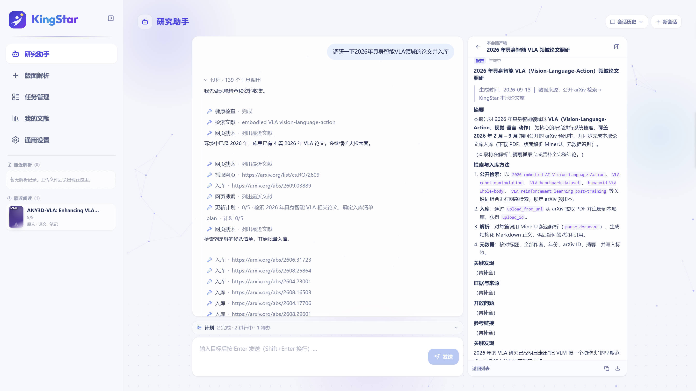
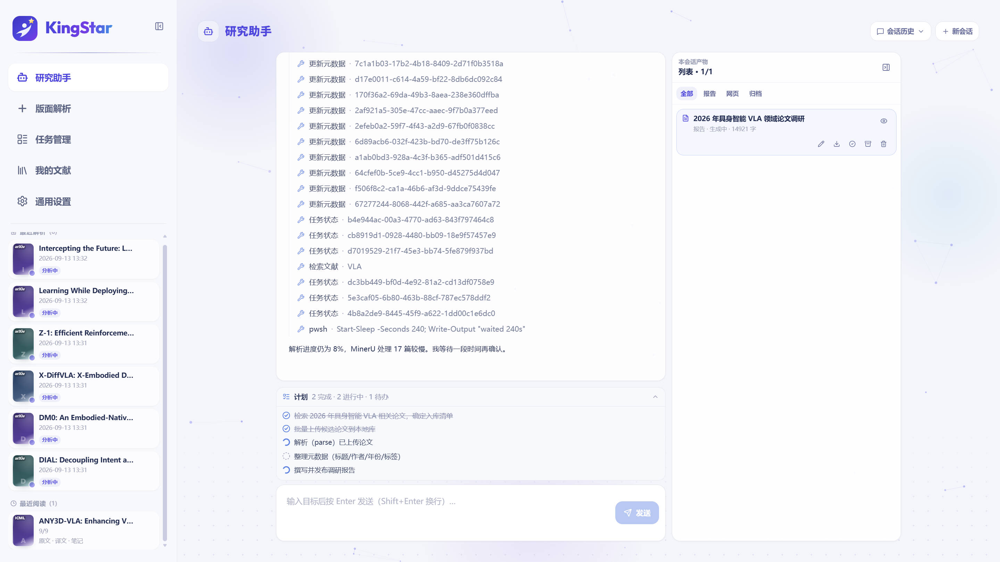
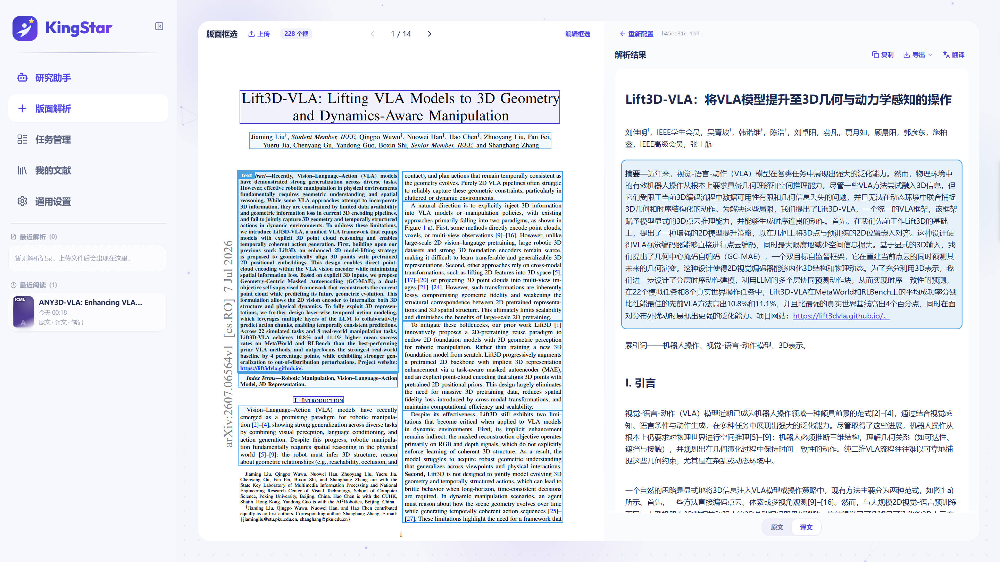
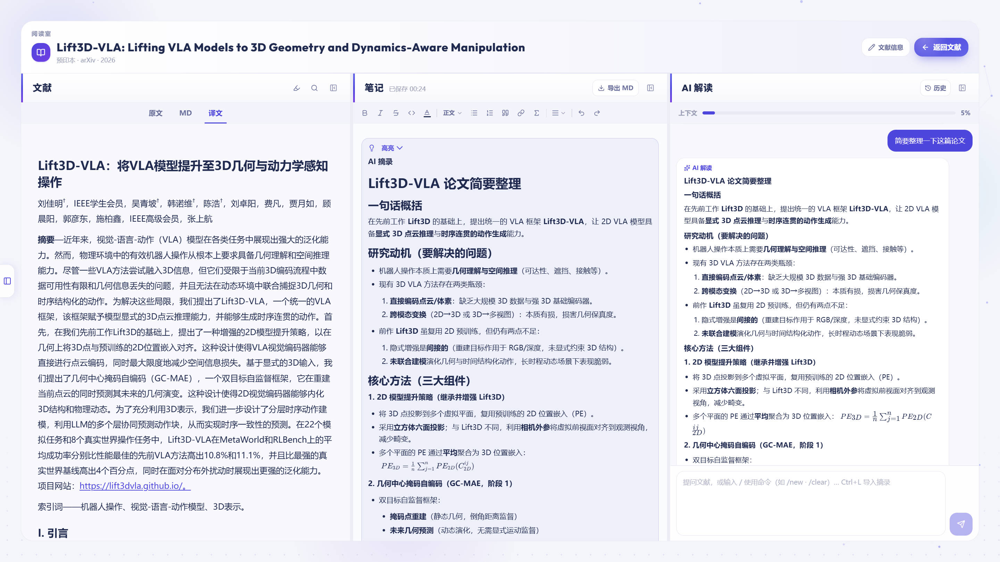

<div align="center">


# KingStar

**本地优先的研究工作台 — 研究助手 · 解析 · 翻译 · 阅读 · 文献管理**

[](LICENSE)
[](services/api/pyproject.toml)
[](apps/web/package.json)
[](services/api)
[](https://github.com/opendatalab/MinerU)

[快速开始](#-快速开始) · [功能特性](#-功能特性) · [架构](#-架构) · [配置](#-配置) · [文档](#-文档)

<br />

<table>
<tr>
<td align="center" width="50%">

</td>
<td align="center" width="50%">

</td>
</tr>
</table>
<p><sub>研究助手 · 目标驱动调研 · 工具调用 · 产物台</sub></p>
</div>

---

## ✨ 功能特性

<table>
<tr>
<td width="50%" valign="top">

### 🤖 研究助手
- 目标驱动：自然语言下目标，自动调研 / 拆步 / 执行
- DeepSeek Harness（`profile=sdk`）+ KingStar MCP 文献工具
- 多会话、流式对话、工具折叠、Todo；右侧**产物台**（流式报告 / 网页摘录卡）
- 可调用入库、解析、翻译、检索、引用导出等能力

### 📄 版面解析
- PDF / 扫描图上传；arXiv / DOI / 直链导入
- 接入 [MinerU](https://github.com/opendatalab/MinerU) 版面分析
- 任务队列、失败重试、进度可视

### 🌐 英译中 & 导出
- 解析后 Markdown 一键翻译（OpenAI 兼容 API）
- 中英双语 PDF 导出（宋体 + Times，公式保留）

</td>
<td width="50%" valign="top">

### 📋 任务管理
- 解析 / 翻译流水线状态一览
- 期刊·会议、年份等元数据标签
- 进入版面解析、导出 Markdown / PDF

### 📚 文献库
- 书架视图、拖拽排序
- AI + Crossref / arXiv 自动识别元数据
- 标签 / 年份 / 类型筛选，BibTeX · RIS 导出

### 📖 阅读室
- 原文 · 译文对照阅读
- 高亮标注、笔记（TipTap）、单篇 AI 问答
- 最近阅读、阅读状态持久化（SQLite）

</td>
</tr>
</table>

---

## 📸 界面预览

<div align="center">

<table>
<tr>
<td align="center" width="50%">
<b>版面解析</b><br/>

</td>
<td align="center" width="50%">
<b>文献阅览</b><br/>

</td>
</tr>
</table>

</div>

---

## 🏗 架构

KingStar 采用 **前端 + BFF + 引擎适配** 的单体仓库。Web 只与 BFF 通信；MinerU、LLM、DeepSeek Harness 作为可替换外接能力。

```text
┌─────────────────────────────────────────────────────────────┐
│  apps/web     React · Vite · Tailwind · React Router          │
│               研究助手 / 解析 / 任务 / 文献 / 阅读 / 设置       │
└──────────────────────────────┬──────────────────────────────┘
                               │ /api  ·  SSE
┌──────────────────────────────▼──────────────────────────────┐
│  services/api   FastAPI BFF · SQLite · MCP (/mcp)             │
│                 uploads · tasks · library · notes · agent     │
├───────────────┬──────────────────┬──────────────────────────┤
│ services/parse│ services/translate│ agent / DeepSeek Harness │
│ MinerU 适配   │ 英译中 · PDF 导出 │ MCP 文献工具 · 产物台     │
└───────┬───────┴────────┬─────────┴────────────┬─────────────┘
        │                │                      │
        ▼                ▼                      ▼
   MinerU API      LLM API (DeepSeek 等)     dsh (sdk profile)
```

| 目录 | 说明 |
|------|------|
| `apps/web` | 前端（Vite + React） |
| `services/api` | 产品 BFF（唯一后端入口；含 Agent / MCP） |
| `services/parse` | MinerU HTTP 适配层 |
| `services/translate` | 翻译与 PDF 导出 |
| `packages/shared` | 前后端共享契约 |
| `docs/` | 架构、Agent、API、截图 |
| `docker/` | 产品镜像 Compose（**实验性，待完善**） |

> **设计原则：** MinerU 是引擎而非 KingStar 源码的一部分；推荐与 MinerU **分体部署**，通过 `MINERU_API_URL` 连接。研究助手的「大脑」为 DeepSeek Harness，文献操作经 MCP 回到本机 BFF。

---

## 🚀 快速开始

### 环境要求

| 组件 | 要求 |
|------|------|
| Node.js | 18+（前端） |
| Python | 3.10+（BFF / 翻译 / Agent） |
| MinerU | 独立部署，提供 HTTP API（[官方文档](https://opendatalab.github.io/MinerU/)） |
| LLM | OpenAI 兼容接口（翻译 / 阅读室 AI / 元数据 / **研究助手必需**） |

### 本地开发（推荐）

```powershell
git clone https://github.com/WxLead/KingStar.git
cd KingStar

# 1) 安装 BFF 依赖（含 Agent：建议 --pre 以安装预发布 harness SDK）
cd services/api
python -m venv .venv
.\.venv\Scripts\Activate.ps1
pip install -e ../parse -e ../translate -e .
# 若 harness 为预发布：pip install --pre -e .

# 2) 安装前端依赖
cd ../../apps/web
npm install

# 3) 配置 MinerU 与 LLM
$env:MINERU_API_URL = "http://<your-mineru-host>:8000"
$env:DEEPSEEK_API_KEY = "sk-..."

# 4) 一键启动（跳过本机 MinerU、使用远程时）
cd ../..
.\scripts\dev-up.ps1 -Background -SkipMinerU
```

| 服务 | 地址 |
|------|------|
| Web | http://127.0.0.1:3000 |
| BFF 健康检查 | http://127.0.0.1:8080/api/v1/health |
| MCP（Agent） | http://127.0.0.1:8080/mcp |
| MinerU 文档 | `http://<host>:8000/docs` |

停止：`.\scripts\dev-down.ps1`

<details>
<summary><b>Linux / macOS</b></summary>

```bash
git clone https://github.com/WxLead/KingStar.git && cd KingStar

cd services/api && python3 -m venv .venv && source .venv/bin/activate
pip install -e ../parse -e ../translate -e .

cd ../../apps/web && npm install

export MINERU_API_URL=http://<your-mineru-host>:8000
export DEEPSEEK_API_KEY=sk-...
# 分终端启动 MinerU → uvicorn → npm run dev
# 详见 docs/local-dev.md
```

</details>

### Docker 部署（待完善）

> **当前不推荐作为主安装路径。** 仓库内已有 `docker/` 编排草稿，但仍存在若干问题（镜像构建、环境变量、与 MinerU 联通等），文档与脚本会持续修正。请优先使用上方**本地开发**流程。

实验性说明见 [docker/README.md](docker/README.md)（标注为 WIP）。

---

## ⚙️ 配置

### LLM（翻译 / AI / 研究助手）

配置 **OpenAI 兼容 Chat API**（默认 DeepSeek）。**不用于** PDF 版面解析（那是 MinerU）。

| 能力 | 消耗 LLM | 说明 |
|------|:--------:|------|
| 研究助手（Harness） | ✅ | 必需 `DEEPSEEK_API_KEY` |
| 英译中翻译 | ✅ | 解析后 Markdown 翻译 |
| 阅读室 AI 助手 | ✅ | 单篇流式问答 |
| 文献元数据识别 | 部分 | AI 抽取 + Crossref / arXiv |
| MinerU 版面分析 | ❌ | `MINERU_API_URL` |
| Crossref / arXiv | ❌ | 公开学术接口 |

**配置优先级：** 设置页 → 环境变量 / `.env` → 默认值

```env
DEEPSEEK_API_KEY=sk-...
DEEPSEEK_BASE_URL=https://api.deepseek.com
DEEPSEEK_MODEL=deepseek-v4-flash
MINERU_API_URL=http://<mineru-host>:8000
```

本地 `.env` 可放在 `services/translate/.env` 或 `services/api/.env`。Agent 相关变量见 [docs/agent.md](docs/agent.md)。

### 健康检查

```bash
curl http://127.0.0.1:8080/api/v1/health
# {"ok":true,"mineru":"up","translate":"ready","llm":"configured",...}
```

---

## 📦 数据与备份

| 内容 | 本地默认 |
|------|----------|
| 文献 / 笔记 / 任务 / Agent 会话与产物 | `services/api/.data/start.db` |
| LLM 设置 | `services/api/.data/llm_settings.json`（路径以实际为准） |
| 上传与解析产物 | `services/api/uploads/` 等 |
| Agent dsh 家目录 / workspace | `services/api/.data/dsh_home` · `dsh_workspace` |

```powershell
.\scripts\backup-data.ps1
```

---

## 🛠 开发

```powershell
# 后台模式 + 日志
.\scripts\dev-up.ps1 -Background -SkipMinerU
Get-Content .\scripts\.logs\bff.log -Wait

# 仅 BFF
cd services/api && .\.venv\Scripts\Activate.ps1
uvicorn start_api.main:app --reload --port 8080

# 仅前端
cd apps/web && npm run dev
```

---

## 📚 文档

| 文档 | 内容 |
|------|------|
| [docs/architecture.md](docs/architecture.md) | 架构与设计原则 |
| [docs/agent.md](docs/agent.md) | 研究助手：Harness + MCP、产物台、API |
| [docs/agent-artifacts-plan.md](docs/agent-artifacts-plan.md) | 产物台设计摘要 |
| [docs/agent-dsh-integration-plan.md](docs/agent-dsh-integration-plan.md) | × dsh 接入设计（已落地，作背景阅读） |
| [docs/local-dev.md](docs/local-dev.md) | 本地开发补充 |
| [docs/api-contracts.md](docs/api-contracts.md) | BFF API 契约 |
| [docker/README.md](docker/README.md) | Docker（**WIP / 待完善**） |

---

## 🤝 参与贡献

欢迎 Issue 与 Pull Request。

1. Fork 本仓库
2. 创建特性分支：`git checkout -b feature/amazing-feature`
3. 提交更改：`git commit -m 'Add amazing feature'`
4. 推送分支：`git push origin feature/amazing-feature`
5. 打开 Pull Request

---

## 📄 开源许可

本项目采用 [MIT License](LICENSE) 开源。

**第三方依赖说明：**

- [MinerU](https://github.com/opendatalab/MinerU) — 版面解析引擎，需单独部署，遵循其自身许可
- LLM / DeepSeek Harness — 需自行申请 API Key，受服务商与相关 SDK 条款约束

---

<div align="center">

**KingStar** — 从目标到文献入库、解析、双语阅读，一条本地研究链路。

[⭐ Star this repo](https://github.com/WxLead/KingStar) · [Report Bug](https://github.com/WxLead/KingStar/issues) · [Request Feature](https://github.com/WxLead/KingStar/issues)

</div>
